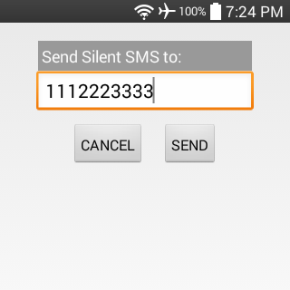

#### [SMS my GPS](https://github.com/warren-bank/Android-SMS-Automatic-Reply-GPS)

Android app that listens for incoming SMS text/data messages and conditionally sends an automatic reply containing GPS location data.

#### Screenshots:

#### Preferences:

* `Enable Service` checkbox:
  * used to enable/disable this service
* ActionBar menu items:
  *  `Add Rule`
    * opens dialog with fields to define a new whitelist rule
  *  `Send Silent SMS`
    * opens dialog to send a silent data-only SMS message to another phone
* whitelist rules contain fields that are compared to all incoming SMS text/data messages:
  * `Sender must end with`:
    * this value specifies a phone number (without any punctuation)
      * a match occurs when either:
        * the _sender_ of the SMS message ends with this exact value
        * this value is exactly equal to the special match-all glob pattern: `*`
  * `Message must begin with`:
    * this value contains any arbitrary string
      * a match occurs when either:
        * the _body_ of the __text__ SMS message begins with this exact value
        * the _body_ of the __data__ SMS message is exactly equal to a _Silent SMS_, as generated by either:
          * the ActionBar menu item: `Send Silent SMS`
          * the app: [Silent Ping SMS for Android](https://github.com/itds-consulting/android-silent-ping-sms)
* whitelist rules can be modified
  * clicking on an existing rule opens a dialog with options to:
    * edit field values, and save changes
    * delete

#### Functionality:

* if:
  * Preferences:
    * service is enabled
  * Android Settings:
    * `Settings` &gt; `Location` &gt; __on__
    * `Settings` &gt; `Location` &gt; `Mode` &gt; __high accuracy__ (GPS)
    * `Settings` &gt; `About phone` &gt; `Network` &gt; `Service state` &gt; __In service__
* when:
  * an incoming SMS text/data message matches any rule in the whitelist
    * a whitelist rule is considered a match when _all_ of its fields match (ie: both _sender_ and _message_)
* then:
  * the sender of the SMS message will receive an automatic reply containing:
    * Latitude
    * Longitude
    * Accuracy (meters)
    * Speed (meters/second)
    * URL to view a map of Lat/Lon on _Google Maps_

#### Notes:

* minimum supported version of Android:
  * Android 3.0 (API level 11)

#### Changelog:

* [Version History](./CHANGELOG.md)

- - - -

#### Caveats:

* _Google Voice_:
  * if:
    * the [_Google Voice_ app](https://play.google.com/store/apps/details?id=com.google.android.apps.googlevoice) is installed on the phone
    * the _Google Voice_ account that the app is logged into:
      * registers the _real_ mobile phone number as a forwarding number
      * configures incoming SMS text messages to be forwarded as well
  * when:
    * a SMS text message is sent to the _Google Voice_ _virtual_ mobile phone number
  * then:
    * the phone receives an incoming SMS text message
  * but:
    * the sender of the SMS message will always be a number belonging to the _Google Voice_ backend infrastructure
    * the body of the SMS message is modified such that it begins with information to identify the _real_ SMS sender:
      * `${original_SMS_sender} - ${original_SMS_body}`
    * where the value of `${original_SMS_sender}` is:
      * a name
        * when the phone number of the _real_ SMS sender is associated with a name in the _Google Voice_ account _Contacts_ list
        * ex: `John Smith`
      * a phone number
        * when the phone number of the _real_ SMS sender is not found in _Contacts_
        * ex: `+19876543210`

- - - -

#### Legal:

* copyright: [Warren Bank](https://github.com/warren-bank)
* license: [GPL-2.0](https://www.gnu.org/licenses/old-licenses/gpl-2.0.txt)
