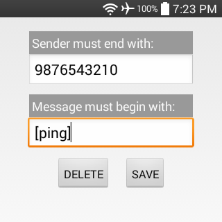
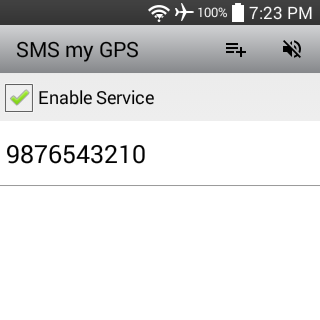
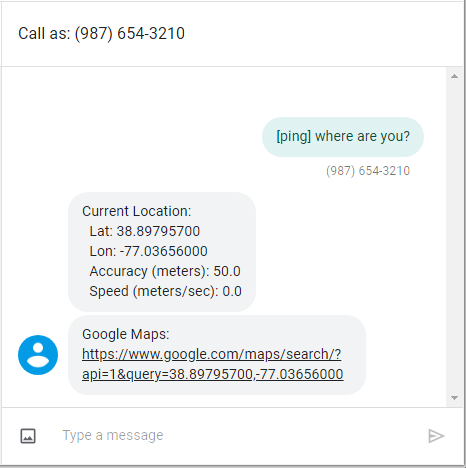

#### [SMS my GPS](https://github.com/warren-bank/Android-SMS-Automatic-Reply-GPS)

Android app that listens for incoming SMS text messages and conditionally sends an automatic reply containing GPS location data.

#### Screenshots:

#### Preferences:

* `Enable Service` checkbox:
  * used to enable/disable this service
* `ADD` ActionBar menu item:
  * adds new rule to whitelist
* whitelist rules are compared to all incoming SMS text messages:
  * `Sender must end with`:
    * this value specifies a phone number (without any punctuation)
      * a match occurs when the _sender_ of the SMS message ends with this exact value
  * `Message must begin with`:
    * this value contains any arbitrary string
      * a match occurs when the _body_ of the SMS message begins with this exact value
* whitelist rules can be modified
  * clicking on an existing rule opens a dialog with options to:
    * edit and save changes
    * delete

#### Functionality:

* if:
  * Preferences:
    * service is enabled
  * Android Settings:
    * `Settings` &gt; `Location` &gt; __on__
    * `Settings` &gt; `Location` &gt; `Mode` &gt; __high accuracy__ (GPS)
    * `Settings` &gt; `About phone` &gt; `Network` &gt; `Service state` &gt; __In service__
* when:
  * an incoming SMS text message matches any rule in the whitelist
* then:
  * the sender of the SMS message will receive an automatic reply containing:
    * Latitude
    * Longitude
    * Accuracy (meters)
    * Speed (meters/second)
    * URL to view a map of Lat/Lon on _Google Maps_

#### Caveats:

* _Google Voice_:
  * if:
    * the [_Google Voice_ app](https://play.google.com/store/apps/details?id=com.google.android.apps.googlevoice) is installed on the phone
    * the _Google Voice_ account that the app is logged into:
      * registers the _real_ mobile phone number as a forwarding number
      * configures incoming SMS text messages to be forwarded as well
  * when:
    * a SMS text message is sent to the _Google Voice_ _virtual_ mobile phone number
  * then:
    * the phone receives an incoming SMS text message
  * but:
    * the sender of the SMS message will always be a number belonging to the _Google Voice_ backend infrastructure
    * the body of the SMS message is modified such that it begins with information to identify the _real_ SMS sender:
      * `${original_SMS_sender} - ${original_SMS_body}`
    * where the value of `${original_SMS_sender}` is:
      * a name
        * when the phone number of the _real_ SMS sender is associated with a name in the _Google Voice_ account _Contacts_ list
        * ex: `John Smith`
      * a phone number
        * when the phone number of the _real_ SMS sender is not found in _Contacts_
        * ex: `+19876543210`

#### Notes:

* minimum supported version of Android:
  * Android 3.0 (API level 11)

#### Version Changelog:

* `v1.1.0`
  * Preference `Sender` changed to `Sender must end with`
    * in `v1.0.0`:
      * exact match
    * in `v1.1.0`:
      * value entered in whitelist rule only needs to occur at the end of the SMS `sender`
      * the purpose for this change is to ignore optional country codes, and such
        * example:
          * rule: `9876543210`
          * SMS sender: `+19876543210`
          * is match?:
            * `v1.0.0`: _no_
            * `v1.1.0`: _yes_

#### Legal:

* copyright: [Warren Bank](https://github.com/warren-bank)
* license: [GPL-2.0](https://www.gnu.org/licenses/old-licenses/gpl-2.0.txt)
